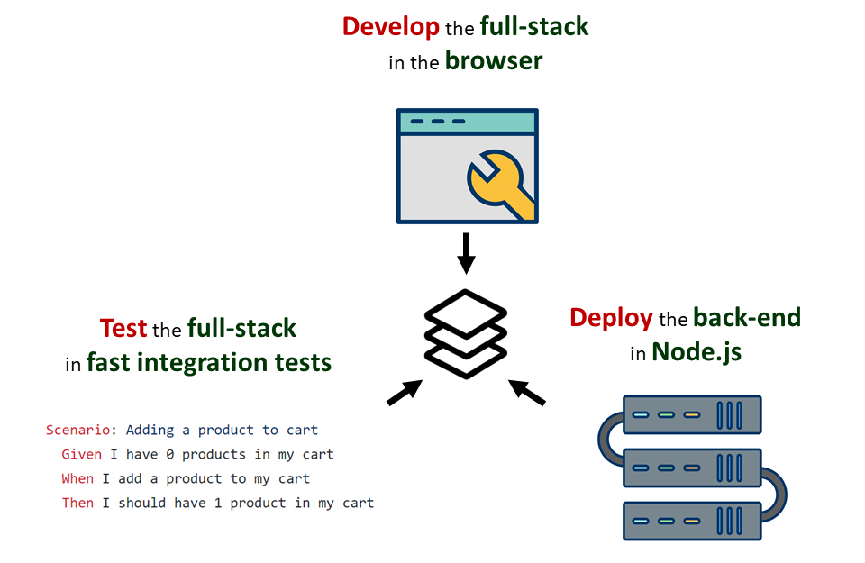

<p align="center"></p>

## Overview

<p align="center"></p>

The primary use case for Ghost RPC is to allow you to develop the full stack in the browser with mock data, create fast and stable full-stack integration tests with the same mock data, and then run your back-end in Node.js everywhere else, all with minimal effort.

Ghost RPC is designed for extreme productivity, testability, and minimal boilerplate for browser-based front-ends with Node.js back-ends. Ghost RPC leverages JavaScript proxies and provides a fluent TypeScript / JavaScript API to allow you to define and invoke your services and create highly testable apps with with minimal wasted effort.

While RESTful semantics are useful for creating standards-based APIs that can be exposed to various consumers, when the only goal is to invoke some code on the back-end (e.g., from a React SPA), and your API is only called from your front-end, RESTful semantics are overkill. In this case, a lot of time and energy is wasted adhering to HTTP semantics, like using the correct verb, HTTP status code, etc., and this additional effort yields little benefit. Ghost RPC is a productive alternative to Node.js RESTful APIs.

## Installation

Ghost RPC:

```bash
npm install ghost-rpc
```

Fastify plug-in:

```
npm install ghost-rpc-fastify
```

## Ghost RPC in Action

Let's assume your app has the following service classes that comprise your back-end API:

```typescript
// services/add-subtract-service.ts

export class AddSubtractService {
  public add(x: number, y: number) {
    return x + y;
  }

  public subtract(x: number, y: number) {
    return x - y;
  }
}

// services/multiply-divide-service.ts

export class MultiplyDivideService {
  public multiply(x: number, y: number) {
    return number1 * number2;
  }

  public divide(x: number, y: number) {
    return x / y;
  }
}
```

The first step with Ghost RPC is to create a factory for your services to allow Ghost RPC to instantiate a fresh instance of the appropriate service class per request. If using TypeScript, you would also create an interface representing all of the services in your app, as shown below.

```typescript
  // services/index.ts

  import { ServicesFactory } from 'ghost-rpc';

  import { CalculatorService } from './services/calculator-service';
  import { TodoService } from './services/todo-service';

  export interface IAppServices {
    addSubtractService: AddSubtractService;
    multiplyDivideService: MultiplyDivideService;
  }

  export const servicesFactory: ServicesFactory<IAppServices> = {
    addSubtractService: () => new AddSubtractService(),
    multiplyDivideService: () => new MultiplyDivideService()
  } 
```

Next, we use the ghost-rpc-fastify plug-in to expose all of your services on the URL path of your choosing (e.g., /api/):

```typescript
  import { createFastifyMiddleware }
  import { servicesFactory } from './services/';

  const server = fastify();
  const ghostRpcMiddleware = createFastifyMiddleware('/api/', servicesFactory);
  server.register(ghostRpcMiddleware);
  
  ...
```

To call your services hosted in Fastify, you would create a Ghost RPC proxy with a HTTP Transport Handler (specifying the same URL path you used above, e.g., /api/):

```typescript
import { createProxy, createHttpTransportHandler } from 'ghost-rpc';

import { IAppServices } from './services/';

const handler = createHttpTransportHandler('/api/');
const proxy = createProxy<IAppServices>(handler);

const sum = await proxy.addSubtractService.add(2, 2);
console.log(sum); // 4

const product = await proxy.multiplyDivideService.divide(4, 2);
console.log(product); // 2
```

When you setup your services in Node.js via the Fastify plug-in and configure the client proxy with an HTTP Transport Handler, each method invocation on a service proxy from the client-side results in Ghost RPC generating an HTTP POST request with JSON payloads in the request and response bodies to a human-readable URL like `https://mydomain.com/api/addSubtractService/add`.

On the other hand, to run the full-stack in the browser for development or leverage your services in integration tests, the only difference is that you pass a Local Handler instead of an HTTP Transport Handler into your proxy. The local handler directly invokes methods in your service classes with no I/O rather than using HTTP to connect to your services running in Node.js.

```typescript
import { createProxy, createLocalHandler } from 'ghost-rpc';

import { IAppServices, servicesFactory } from './services/';

const handler = createLocalHandler(servicesFactory);
const proxy = createProxy<IAppServices>(handler);

const sum = await proxy.addSubtractService.add(2, 2);

console.log(sum); // 4
```

## Examples

* [Shopping Cart App](./examples/shopping-cart-app) - A demo showcasing Ghost RPC with React, Redux and TypeORM + SQL.js. The same service classes, database schema, data access logic, and front-end Redux state management logic are exercised from integration tests, the full stack running in the browser (mock mode), and the stack separated between the browser and Node.js (full mode).

* [Benchmark](./examples/benchmark) - Compares the performance of Ghost RPC Fastify to plain Fastify

## API Docs (WIP)

* Proxies
* Service factories
* Local / Transport Handlers
* Pre-request hooks
* Global request and response params
* Error handling

## Future Plans

* Additional transport handlers (e.g, binary instead of HTTP + JSON)
* Middleware plug-ins for auth, etc. with the ability to use decorators to apply middleware per service class / method
* Support for other Node.js frameworks (e.g., Express, Hapi)
* Ability to run as a stand-alone server with no need for Fastify, Express, etc.
* Deno support
